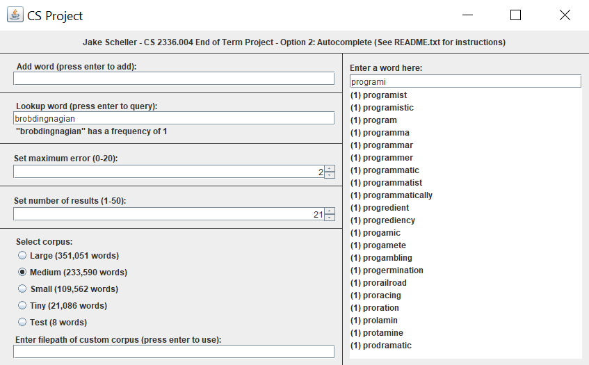

# Computer Science 2 final project
This is my final project for Computer Science 2. It is a Java implementation of the fuzzy autocomplete algorithm from [this paper](http://www2009.eprints.org/38/1/p371.pdf) I read a few years ago\[1\]. Fuzzy autocomplete means that the program takes a string as an input and returns a list of similar strings, even if the input string is not an exact prefix of the returned strings. Specifically, the program tries to determine which word the user is typing before he/she has finished typing it. It would be a lot more accurate if I had included word frequencies in my datasets, but I didn't end up doing so.

When you run the program, you can optionally provide a file path as a runtime argument; the program will initialize the trie with words from this file. The file must be a plain text list of newline-separated words. If no path is provided, the program will use one of the dictionaries I have included. After the program starts, you can still load your own dictionary by entering its path into the bottom text field on the left and pressing enter. To add a word to the dictionary, enter it in the first text field on the left and press enter. To lookup the frequency of a word in the dictionary, enter it in the second text field on the left and press enter. To autocomplete a word, enter it into the text field on the right. As you type, the program will display suggested completions, along with their frequencies in the dictionary. You can't really do anything with the completions; it's a pretty useless program. To increase the maximum error of the autocomplete algorithm, use the corresponding slider on the left. The error is based on the edit distance between the completion and the input. Only substitutions and deletions count towards the error, because insertions technically have zero cost in my algorithm.

The program requires that the working directory be the main project folder (the one with src, datasets, and out sub-folders). Use 'javac -d out \*.java' to compile and use 'java -cp out autocomplete.Tester' to run. This means that all paths passed to the program are relative to the main project folder. Sorry if that's all really obvious, I'm not sure if that's the normal way to compile and run java code.

## Datasets
The datasets folder contains a number of word lists. Each file is a newline delimited list of English words where each word consists of only lowercase letters. None of the words contains any digits or punctuation.

For every dataset listed below, I made the following modifications:
* Converted every word to lowercase
* Removed every word that did not match the regex ^[a-z]+$
* Removed every line that matched the regex ^[b-hj-z]$
* Removed any duplicate lines
* Sorted the file alphabetically

I got these datasets from www.puzzlers.org:
* words-large.txt (351051 unique words) is http://www.puzzlers.org/pub/wordlists/mbsingle.txt
* words-medium.txt (233590 unique words) is http://www.puzzlers.org/pub/wordlists/web2.txt
* words-small.txt (109562 unique words) is http://www.puzzlers.org/pub/wordlists/pubbrand.txt
* words-tiny.txt (21086 unique words) is http://www.puzzlers.org/pub/wordlists/pocket.txt

Additionally, I made two test corpora:
* words-test.txt (8 unique words) is a very small word list I made for testing the trie.
* words-custom-test.txt (21 words, some of which are duplicates) is a small word list I made for testing the custom corpus feature, as well as for testing duplicate words.

## References
\[1\] [Ji, Shengyue](http://www2009.eprints.org/view/author/Ji=3AShengyue=3A=3A.html) and [Li, Guoliang](http://www2009.eprints.org/view/author/Li=3AGuoliang=3A=3A.html) and [Li, Chen](http://www2009.eprints.org/view/author/Li=3AChen=3A=3A.html) and [Feng, Jianhua](http://www2009.eprints.org/view/author/Feng=3AJianhua=3A=3A.html) (2009) *[Efficient Interactive Fuzzy Keyword Search](http://www2009.eprints.org/38/)*. 18th International World Wide Web Conference, April 20th-24th, 2009, Madrid, Spain.
